# 🌡️ Smart IoT-Based Temperature Monitoring & AI Prediction System

<p align="left">
  
  
  
  
  
  
  
  
  
  
</p>

**Smart IoT-Based Temperature Monitoring & AI Prediction System** is an end-to-end Internet of Things (IoT) solution that combines embedded systems, cloud computing, machine learning, and mobile application development into a single intelligent monitoring platform.

The system continuously collects environmental temperature and humidity using an **ESP32** and **DHT22 sensor**, uploads live sensor readings to **ThingSpeak Cloud**, predicts future temperature values using a trained **Machine Learning model**, and allows users to monitor everything through a custom-built **MIT App Inventor Android application**.

Unlike traditional monitoring systems, this project not only displays real-time sensor readings but also predicts future temperature trends using Artificial Intelligence, enabling proactive environmental monitoring.

---

# 📑 Table of Contents

- [About the Project](#about-the-project)
- [Objectives](#objectives)
- [System Architecture](#system-architecture)
- [Working Flow](#working-flow)
- [Core Features](#core-features)
- [Tech Stack](#tech-stack)
- [Hardware Components](#hardware-components)
- [Software Components](#software-components)
- [Project Structure](#project-structure)
- [Machine Learning Model](#machine-learning-model)
- [Dataset](#-dataset)
- [Cloud Services](#cloud-services)
- [Installation & Setup](#installation-setup)
- [Configurations](#configurations)
- [Screenshots](#screenshots)
---

<a id="about-the-project"></a>

# 📖 About the Project

Environmental monitoring plays an important role in agriculture, industries, healthcare, laboratories, warehouses, and smart homes. While many IoT systems provide real-time monitoring, very few integrate predictive analytics to estimate future environmental conditions.

This project bridges that gap by combining:

- IoT Hardware
- Cloud Storage
- Machine Learning
- REST APIs
- Mobile Application
- Cloud Deployment

The ESP32 collects environmental data from a DHT22 sensor and immediately uploads it to ThingSpeak Cloud, we have used ESP32 as the microcontroller device here. Simultaneously, the latest sensor values are sent to a Machine Learning model deployed using Hugging Face Spaces (or a local Flask REST API) to predict the temperature for upcoming hours.

The Android application displays both current and predicted temperatures, giving users real-time insights as well as future forecasts.

---

<a id="objectives"></a>
# 🎯 Objectives

- Continuously monitor temperature and humidity
- Upload live sensor readings to ThingSpeak Cloud
- Display real-time readings on an LCD Display
- Predict future temperatures using Machine Learning
- Visualize sensor data remotely
- Build an Android application for easy monitoring
- Demonstrate cloud deployment using Hugging Face
- Learn end-to-end IoT architecture

---

<a id="system-architecture"></a>

# 🏗️ System Architecture


```
               +---------------------+
               |      DHT22 Sensor   |
               +----------+----------+
                          |
                          |
                    Temperature &
                       Humidity
                          |
                          ▼
                    +-----------+
                    |   ESP32   |
                    +-----------+
                     |         |
                     |         |
               LCD Display  WiFi Upload
                     |         |
                     ▼         ▼
              16x2 I2C LCD  ThingSpeak Cloud
                                 |
                                 |
                                 ▼
                        Hugging Face ML Model
                                 or
                          Local Flask API
                                 |
                                 ▼
                         Future Temperature
                             Prediction
                                 |
                                 ▼
                     MIT App Inventor App
```

---

<a id="working-flow"></a>
# 🔄 Working Flow

1. ESP32 reads temperature and humidity from the DHT22 sensor.
2. Sensor values are displayed on the I2C LCD.
3. ESP32 connects to WiFi.
4. Sensor readings are uploaded to ThingSpeak.
5. ESP32 sends the latest readings to the Machine Learning API.
6. The ML model predicts future temperatures.
7. Predicted values are returned as JSON.
8. The Android application displays:
   - Current Temperature
   - Current Humidity
   - Future Temperature Prediction

---

<a id="core-features"></a>

# ✨ Core Features

## 🌡️ Real-Time Temperature Monitoring

- Live temperature measurement
- Live humidity monitoring
- Automatic refresh
- High accuracy using DHT22

---

## ☁️ Cloud Integration

- Automatic upload to ThingSpeak
- Remote monitoring
- Historical data storage
- Data visualization

---

## 🤖 AI Temperature Prediction

- Predict next N hours temperature
- XGBoost Machine Learning Model
- Recursive prediction
- REST API support

---

## 📱 Mobile Application

- Built using MIT App Inventor
- Displays current temperature
- Displays humidity
- Shows AI predictions
- User-friendly interface

---

## 📟 LCD Display

Real-time information displayed directly on the LCD:

- Temperature
- Humidity
- WiFi Status
- Prediction Status

---

## 🌍 Cloud Deployment

Supports two deployment options:

- Hugging Face Spaces (Online)
- Local Flask REST API

---


<a id="tech-stack"></a>
# 💻 Tech Stack

| Category | Technology |
|-----------|------------|
| Microcontroller | ESP32 |
| Sensor | DHT22 |
| Display | 16x2 I2C LCD |
| Programming Language | C++, Python |
| IDE | Arduino IDE |
| Machine Learning | XGBoost |
| API | Flask REST API |
| Cloud | Hugging Face Spaces |
| IoT Platform | ThingSpeak |
| Mobile App | MIT App Inventor |
| Data Analysis | Pandas |
| Numerical Computing | NumPy |
| UI | Gradio |

---


<a id="hardware-components"></a>
# 🔌 Hardware Components

| Component | Quantity |
|------------|----------|
| ESP32 Development Board | 1 |
| DHT22 Temperature Sensor | 1 |
| 16x2 I2C LCD | 1 |
| USB Cable | 1 |
| Jumper Wires | Several |
| Breadboard (Optional) | 1 |
| WiFi Connection | Required |

---


<a id="software-components"></a>
# 💾 Software Components

- Arduino IDE
- Python 3.10+
- Flask
- Gradio
- Hugging Face
- ThingSpeak
- MIT App Inventor
- VS Code
- Git

---


<a id="project-structure"></a>
# 📂 Project Structure


```text
IOT/
│
├── ai_model/
│   ├── dataset.csv
│   ├── iot.ipynb
│   └── temperature_predictor.pkl
│
├── hardware/
│   ├── circuit_diagram.PNG
│   └── esp32_code.ino
│
├── huggingface_deployment/
│   ├── app.py
│   ├── requirements.txt
│   └── temperature_predictor.pkl
│
├── local_api/
│   ├── request.py
│   └── restApi.py
│
├── mobile_app/
│   └── IOT_App.aia
│
├── screenshots/
│   ├── app_home.png
│   ├── circuit_diagram.png
│   ├── dashboard.png
│   ├── gradio_interface.png
│   ├── gradio_prediction.png
│   ├── lcd_output.png
│   ├── live_temperature.png
│   ├── model_training.png
│   ├── thingspeak_dashboard.png
│   ├── thingspeak_humidity.png
│   ├── thingspeak_temperature.png
│   └── workflow.png
│
└── README.md

```

---

<a id="machine-learning-model"></a>
# 🧠 Machine Learning Model

The project uses a trained **XGBoost Regression Model** to estimate future temperatures.

### Input Features

- Current Temperature
- Current Humidity
- Month
- Day
- Hour
- Minute
- Second
- Day of Week

### Output

Future temperature values for the next **N hours**.

The model is trained using historical environmental data and serialized into a `.pkl` file, which is loaded by both the Hugging Face deployment and the local Flask REST API.

---

<a name="dataset"></a>
# 📊 Dataset

The machine learning model used in this project was trained using a publicly available environmental sensor dataset obtained from Kaggle.

To keep this repository lightweight, only a **sample dataset (1,0000 records)** is included.

The complete dataset can be downloaded from the original Kaggle source:

🔗 **Dataset Link:** *https://www.kaggle.com/datasets/patrickfleith/temperature-humidity-pressure-illuminance/data*

After downloading:

1. Place the dataset inside the `ai_model/` directory.
2. Rename it to `dataset.csv` (if required).
3. Run `iot.ipynb` to retrain the model.

> **Note:** The sample dataset is provided only to demonstrate the expected data format. The full dataset should be downloaded from the original source for training and experimentation.

---


<a id="cloud-services"></a>
# ☁️ Cloud Services

This project integrates multiple cloud platforms:

| Service | Purpose |
|----------|----------|
| ThingSpeak | Sensor Data Storage |
| Hugging Face | Machine Learning Deployment |
| GitHub | Source Code |
| MIT App Inventor | Android Application |

---

<a id="installation-setup"></a>

# 🚀 Installation & Setup

Follow the steps below to set up and run the complete project on your local machine.

---

# 📋 Prerequisites

Before starting, make sure you have the following installed:

### Hardware

- ESP32 Development Board
- DHT22 Temperature & Humidity Sensor
- 16x2 I2C LCD Display
- Jumper Wires
- USB Cable

---

### Software

- Arduino IDE (Latest Version)
- Python 3.10+
- VS Code (Recommended)
- Git
- MIT App Inventor Account
- ThingSpeak Account
- Hugging Face Account

---

# ⚙️ Step 1 — Clone the Repository

```bash
git clone https://github.com/YOUR_USERNAME/YOUR_REPOSITORY.git

cd YOUR_REPOSITORY
```

---

# ⚙️ Step 2 — Project Directory

After cloning, your project should look like:

```text
IOT/
│
├── ai_model/
├── hardware/
├── huggingface_deployment/
├── local_api/
├── mobile_app/
├── screenshots/
└── README.md
```

---

# ⚙️ Step 3 — Install Arduino IDE

Download Arduino IDE:

https://www.arduino.cc/en/software

---

# ⚙️ Step 4 — Install ESP32 Board Package

Open Arduino IDE

```
File
    → Preferences
```

Paste the following URL into **Additional Boards Manager URLs**

```
https://raw.githubusercontent.com/espressif/arduino-esp32/gh-pages/package_esp32_index.json
```

Now open

```
Tools
    → Board
        → Boards Manager
```

Search

```
ESP32
```

Install

```
ESP32 by Espressif Systems
```

---

# ⚙️ Step 5 — Install Required Arduino Libraries

Open

```
Sketch
    → Include Library
        → Manage Libraries
```

Install the following libraries:

- DHT Sensor Library
- Adafruit Unified Sensor
- LiquidCrystal_I2C
- ThingSpeak
- ArduinoJson
- WiFi

---

# ⚙️ Step 6 — Connect the Hardware

Connect the components according to the provided circuit diagram.

### ESP32 ↔ DHT22

| DHT22 | ESP32 |
|--------|--------|
| VCC | 3.3V |
| DATA | GPIO 22 *(or your configured pin)* |
| GND | GND |

---

### ESP32 ↔ LCD

| LCD | ESP32 |
|------|--------|
| VCC | 5V |
| GND | GND |
| SDA | GPIO21 |
| SCL | GPIO22 |

---

Circuit Diagram:

```
hardware/
    └── circuit_diagram.PNG
```

---

# ☁️ Step 7 — Create a ThingSpeak Account

Create a free account at:

https://thingspeak.mathworks.com/

---

# 📊 Step 8 — Create a New Channel

Create a new channel.

Example:

```
Temperature Monitoring
```

Create Fields:

```
Field 1 → Temperature

Field 2 → Humidity
```

Save the channel.

---

# 🔑 Step 9 — Copy ThingSpeak Credentials

Open

```
API Keys
```

Copy:

- Channel ID
- Write API Key
- Read API Key

---

Update these values inside the ESP32 code.

Example:

```cpp
unsigned long channelID = YOUR_CHANNEL_ID;

const char* writeAPIKey = "YOUR_WRITE_API_KEY";

const char* readAPIKey = "YOUR_READ_API_KEY";
```

---

# 📶 Step 10 — Configure WiFi

Inside

```
hardware/
    esp32_code.ino
```

Replace

```cpp
const char* ssid = "YOUR_WIFI_NAME";

const char* password = "YOUR_WIFI_PASSWORD";
```

with your WiFi credentials.

---

# 🤖 Step 11 — Python Environment

Open Terminal.

Navigate to

```
huggingface_deployment/
```

Create virtual environment

```bash
python -m venv venv
```

Activate

### Windows

```bash
venv\Scripts\activate
```

### Linux / macOS

```bash
source venv/bin/activate
```

---

# 📦 Step 12 — Install Python Packages

Run

```bash
pip install -r requirements.txt
```

Required packages include:

- pandas
- numpy
- scikit-learn
- xgboost
- gradio

---

# 🤗 Step 13 — Create a Hugging Face Account

Create a free account.

https://huggingface.co/

---

# 🚀 Step 14 — Deploy the ML Model

Create a new

```
Space
```

Choose

```
Gradio
```

Upload:

```
app.py

temperature_predictor.pkl

requirements.txt
```

After deployment your endpoint will look similar to:

```
https://YOUR_USERNAME-temperature-predictor.hf.space
```

---

# 🌐 Step 15 — Update the Hugging Face API URL

Inside

```
request.py

esp32_code.ino
```

Replace

```python
API_URL="https://YOUR_USERNAME-temperature-predictor.hf.space/gradio_api/call/predict/"
```

with your deployed URL.

---

# 🖥️ Step 16 — Local Flask API (Optional)

If you don't want to use Hugging Face, you can run the API locally.

Navigate to

```
local_api/
```

Run

```bash
python restApi.py
```

The API starts at

```
http://127.0.0.1:5000
```

Prediction endpoint

```
POST

/predict
```

Example JSON

```json
{
    "temp":27,
    "humidity":70,
    "n":6
}
```

---

# 📱 Step 17 — MIT App Inventor

Go to

https://appinventor.mit.edu/

Login.

Choose

```
Projects

Import project (.aia)
```

Import

```
mobile_app/

IOT_App.aia
```

---

# 📱 Step 18 — Configure the MIT App Inventor Project

Open **MIT App Inventor** and import the project:

```
Projects
    → Import Project (.aia)
```

Select:

```
mobile_app/
    └── IOT_App.aia
```

Once the project is imported, open the **Blocks** editor.

Locate the following four global variables and replace the placeholder values with your own credentials.

---

### 1️⃣ Temperature ThingSpeak URL

Replace:

```
https://api.thingspeak.com/channels/YOUR_CHANNEL_ID/fields/1.json?api_key=YOUR_READ_API_KEY&results=1
```

with your own **ThingSpeak Temperature API URL**.

---

### 2️⃣ Humidity ThingSpeak URL

Replace:

```
https://api.thingspeak.com/channels/YOUR_CHANNEL_ID/fields/2.json?api_key=YOUR_READ_API_KEY&results=1
```

with your own **ThingSpeak Humidity API URL**.

---

### 3️⃣ ThingSpeak Read API Key

Replace:

```
YOUR_API_KEY
```

with your **ThingSpeak Read API Key**.

---

### 4️⃣ Hugging Face Prediction URL

Replace:

```
https://YOUR_USERNAME-temperature-predictor.hf.space
```

with the URL of your deployed Hugging Face Space.

For example:

```
https://johnsmith-temperature-predictor.hf.space
```

---

After updating these four blocks, save the project and build the Android application.

```
Build
    → Android App (.apk)
```

Install the generated APK on your Android device and begin monitoring real-time sensor data and AI-based temperature predictions.

> **Note:** If you are using the **Local Flask API** instead of Hugging Face, replace the `huggingfaceURL` block with your local server address (for example, `http://192.168.1.5:5000`) and ensure your phone and computer are connected to the same Wi-Fi network.


# 🔥 Step 19 — Upload ESP32 Code

Open

```
hardware/

esp32_code.ino
```

Select

```
ESP32 Dev Module
```

Choose the correct COM Port.

Upload the sketch.

---

# ▶️ Step 20 — Verify the System

After uploading:

- ESP32 connects to WiFi
- LCD displays Temperature & Humidity
- Data appears on ThingSpeak
- Prediction request is sent
- Hugging Face returns predictions
- Android App displays the results

---


<a id="configurations"></a>
# 🔑 Configurations

Before running the project, replace every placeholder below with your own values.

| Variable | Replace With |
|-----------|--------------|
| WiFi SSID | Your WiFi Name |
| WiFi Password | Your WiFi Password |
| ThingSpeak Channel ID | Your Channel ID |
| ThingSpeak Write API Key | Your Write API Key |
| ThingSpeak Read API Key | Your Read API Key |
| Hugging Face URL | Your Space URL |
| Flask API URL | Local IP (Optional) |

---

# 🌐 External Services Used

| Platform | Purpose |
|-----------|----------|
| Arduino IDE | ESP32 Programming |
| ThingSpeak | IoT Cloud Platform |
| Hugging Face | ML Model Deployment |
| MIT App Inventor | Android Application |
| GitHub | Source Code Hosting |

---

# 📡 REST API

## Endpoint

```
POST /predict
```

---

### Request

```json
{
    "temp":28,
    "humidity":65,
    "n":6
}
```

---

### Response

```json
{
    "success":true,
    "predictions":[
        28.2,
        28.5,
        28.7,
        29.1,
        29.4,
        29.6
    ]
}
```

---


<a id="screenshots"></a>
# 📸 Screenshots

The following screenshots demonstrate different parts of the project. Place all images inside the `screenshots/` directory.

---

## 📱 Android Application

<details>
<summary>Click to View Mobile Application</summary>

### Home Screen

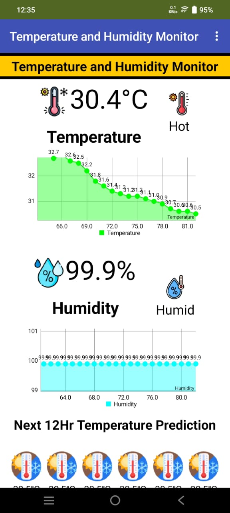

---

### Live Temperature & AI Prediction

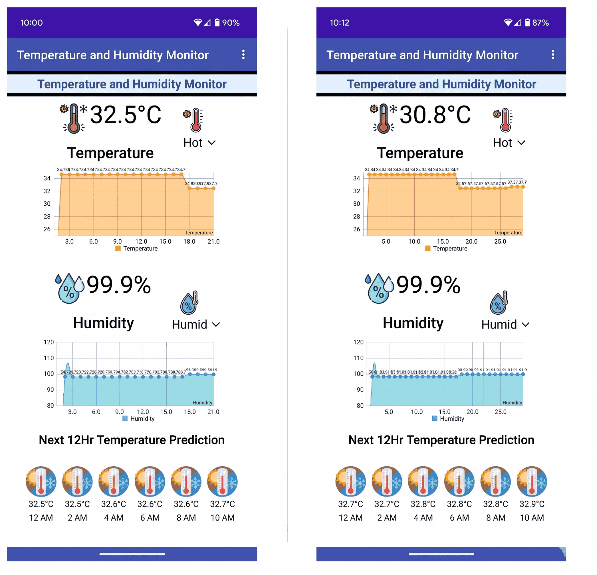

---

### Complete Dashboard

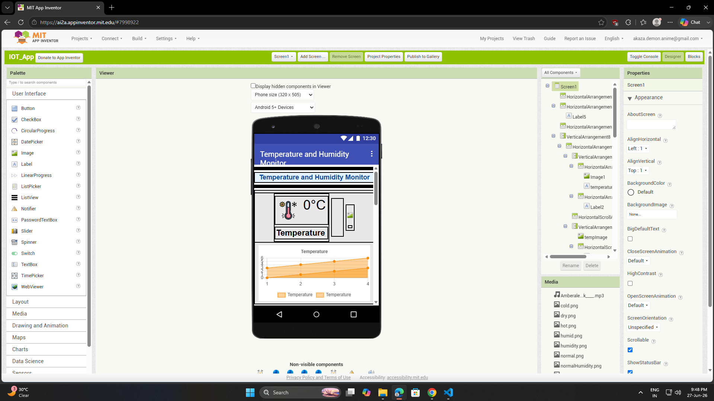

</details>

---

## 📊 ThingSpeak Dashboard

<details>
<summary>Click to View ThingSpeak Dashboard</summary>

### Temperature Graph

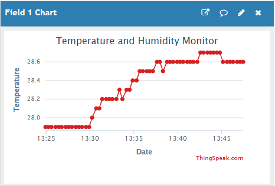

---

### Humidity Graph

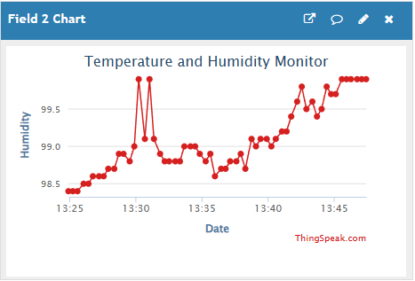

---

### Complete Dashboard

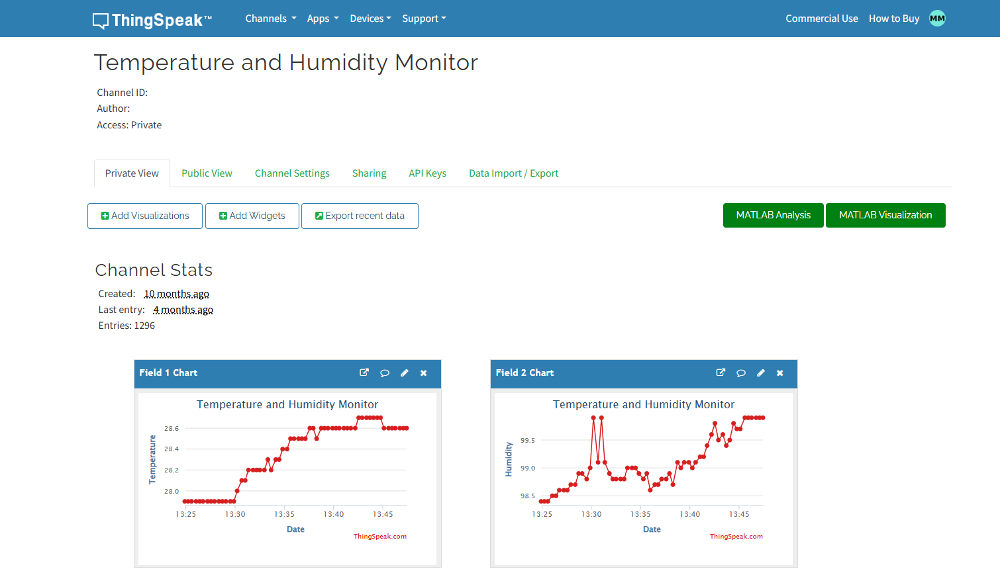

</details>

---

## 📟 ESP32 Output

<details>
<summary>Click to View ESP32 Output</summary>

### LCD Display

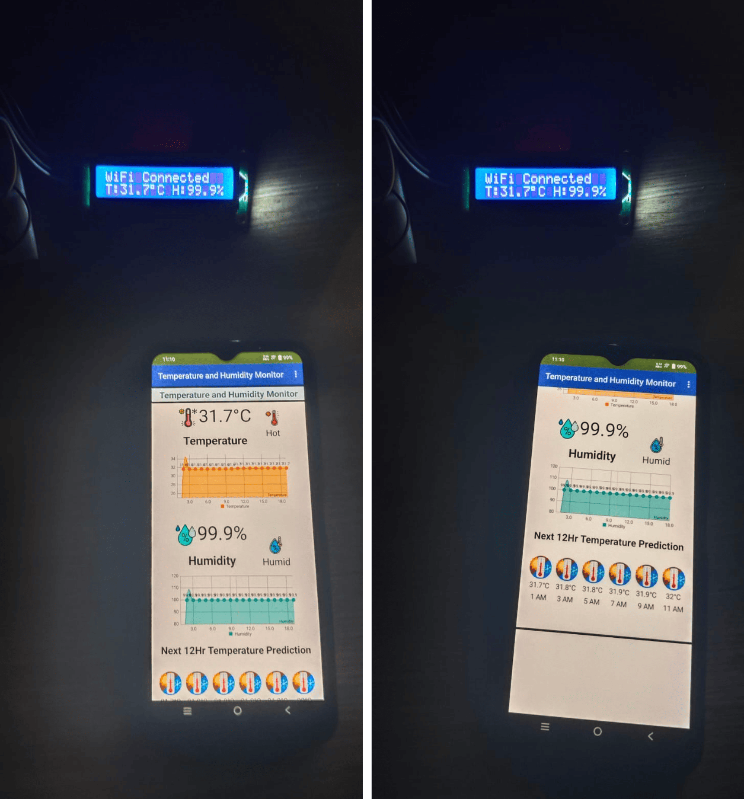

</details>

---

## 🔌 Circuit Diagram

<details>
<summary>Click to View Circuit Diagram</summary>

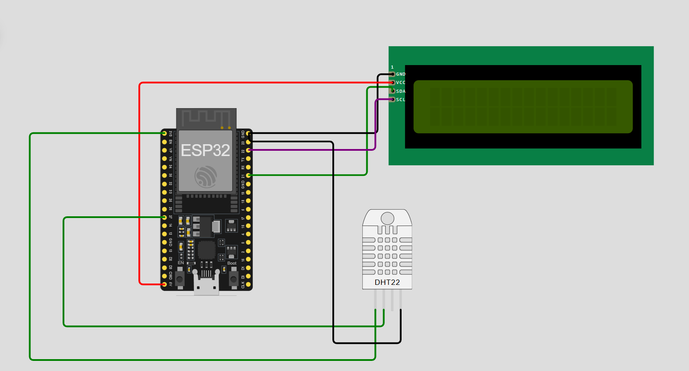

</details>

---

## 🤖 Hugging Face Deployment

<details>
<summary>Click to View Hugging Face Deployment</summary>

### Gradio Interface

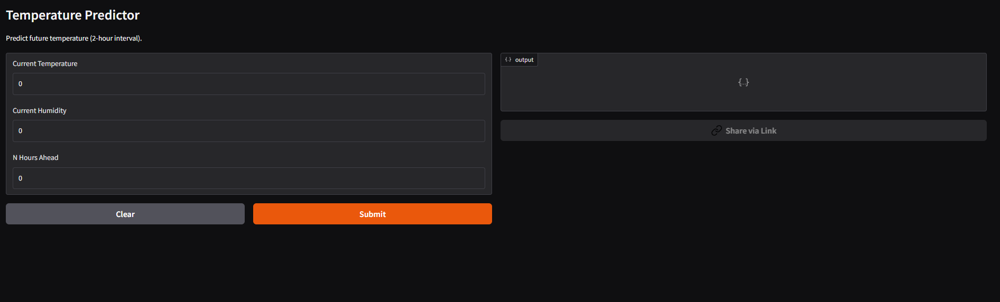

---

### Prediction Output

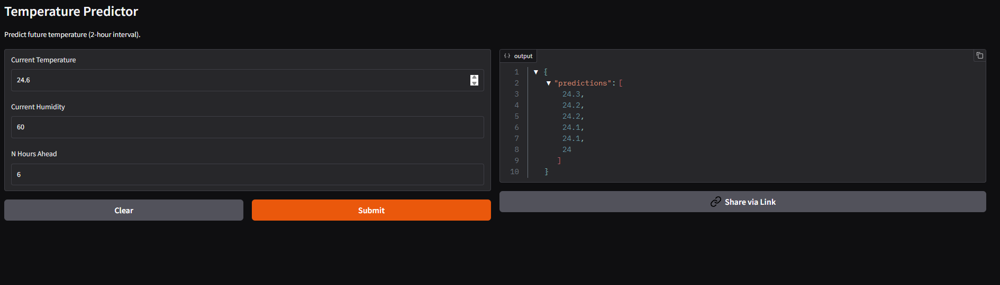

</details>

---

## 🧠 Machine Learning

<details>
<summary>Click to View Machine Learning Workflow</summary>

### Model Training

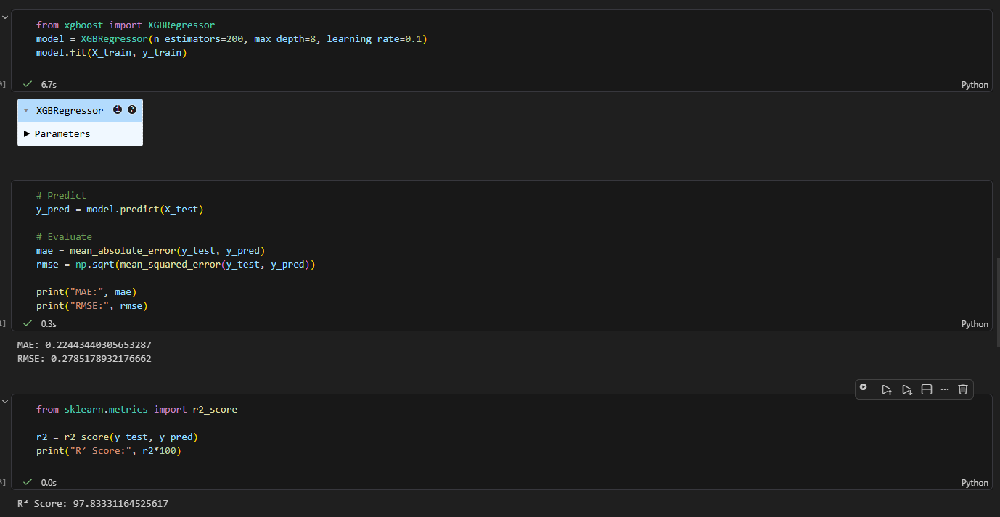

---

</details>

---

# 🔄 Project Workflow

<details>
<summary>Click to View Workflow Diagram</summary>

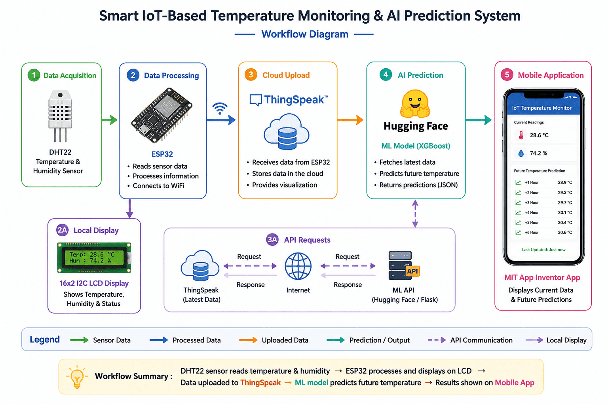

</details>

---
